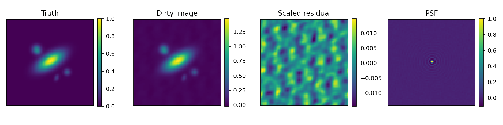

# Radio Pipeline Control Lab

[](https://github.com/pkd-45/radio-pipeline-control-lab/actions/workflows/ci.yml)

A compact, tested portfolio project combining a **synthetic radio-interferometric processing pipeline** with the execution-control features required to operate scientific workflows reliably on shared computing infrastructure.

The repository demonstrates two evidence levels:

1. **Implemented and tested:** Python pipeline design, numerical validation, retries, restart/resume, product integrity checks, structured events, SQLite state, quality gates, and Slurm dependency planning.
2. **Exploratory adapters:** small, isolated Kafka, etcd, and PyTango integrations that show a deliberate learning path without claiming production experience.

This is independent portfolio software. It is **not official SKAO software**, does not use SKAO code or data, and is not presented as production-ready observatory infrastructure.

## Why this project exists

My established work combines scientific Python, survey data products, machine learning, and Slurm-based HPC workflows. This project makes the software-engineering side of that experience directly inspectable: it turns a radio-processing problem into a configuration-driven pipeline with observable state, traceable products, failure recovery, resource descriptions, and automated tests.

## Processing chain

```text
synthetic sky + uv sampling
          |
          v
simulate visibilities
  - antenna-based complex gains
  - thermal noise
  - injected RFI-like outliers
          |
          v
robust radial flagging
          |
          v
reference-antenna calibration
          |
          v
visibility gridding + dirty imaging + PSF
          |
          v
science QA gates + product manifest + diagnostic plot
```

Around the science stages:

```text
                 observatory-facing boundary
       +---------------------------------------------+
       | PipelineControlService                      |
       | start / abort / status                      |
       +----------------------+----------------------+
                              |
                  +-----------+-----------+
                  |                       |
            run-state store          telemetry events
            SQLite / etcd            JSONL / Kafka
                  |                       |
                  +-----------+-----------+
                              |
                      PipelineExecutor
                  retries / resume / checksums
                              |
           simulate -> flag -> calibrate -> image -> QA
                              |
                    Slurm scripts and DAG submission
```

## Demonstrated engineering behaviour

- Typed, installable Python package with a CLI.
- Explicit stage dependencies and per-stage resource declarations.
- Persisted attempt history using SQLite in WAL mode.
- Automatic retry of transient stage failures.
- Safe restart: successful stages are skipped only when their output checksums still verify.
- Tamper detection: a changed or missing product is recomputed.
- Cancellation marker checked between stages.
- Structured JSONL events for operational observability.
- Atomic JSON report writing and SHA-256 product provenance.
- Quantitative science-quality gates, not only “the code ran”.
- Slurm `sbatch` generation with `afterok` dependency chains.
- Unit, integration, adapter-boundary, retry, resume, and corruption tests.
- GitHub Actions CI across Python 3.11–3.13.
- Independently validated on a Linux Slurm cluster with Python 3.11.15.

## Reproducible demo result

The committed configuration produces the following deterministic QA result:

| Metric | Result | Gate |
|---|---:|---:|
| Antenna-gain NRMSE | 0.0036 | ≤ 0.15 |
| Calibrated-visibility NRMSE | 0.0107 | ≤ 0.20 |
| Injected-interference recall | 0.76 | ≥ 0.65 |
| Flag false-positive rate | 0.0099 | ≤ 0.02 |
| Scaled dirty-image NRMSE | 0.0366 | ≤ 0.45 |
| Finite output fraction | 1.0 | = 1.0 |



These values are synthetic regression targets, not claims about telescope performance.

## Quick start

```bash
python -m venv .venv
source .venv/bin/activate
python -m pip install -e '.[dev]'

ruff check .
mypy src
pytest
radio-pipeline-lab plan --config configs/demo.toml
radio-pipeline-lab run --config configs/demo.toml
radio-pipeline-lab status --config configs/demo.toml
```

Run the pipeline a second time to demonstrate verified restart/resume. Completed stages are skipped only when their output hashes still match the recorded products.

## Demonstrate failure recovery

Copy `configs/demo.toml` and set:

```toml
fail_once_stage = "calibrate"
```

The calibration stage fails once, records the failed attempt and event, then succeeds on the configured retry.

## Generate the Slurm execution plan

```bash
radio-pipeline-lab slurm-plan \
  --config configs/slurm.toml \
  --output-dir generated-slurm
```

This writes one `sbatch` file per stage and a submission script that encodes the DAG using `--dependency=afterok`. The separate Slurm configuration uses a distinct run ID and output directory so local and scheduler-backed validation histories do not get mixed. Generate these files on the execution host after activating the intended Python environment; the scripts capture absolute interpreter and configuration paths so batch execution does not depend on shell initialisation. See [Cluster execution](docs/CLUSTER_RUN.md).

## Optional learning adapters

The core pipeline has no Kafka, etcd, or Tango requirement. Optional adapters are isolated under `radio_pipeline_lab.adapters`:

- `KafkaEventPublisher`: publishes structured pipeline events.
- `EtcdV3CoordinationStore`: writes and reads run state through the etcd v3 JSON gateway.
- `build_tango_device`: exposes start, abort, state, and progress through a small optional PyTango device.

The Kafka boundary is tested with an injected producer. The etcd boundary is tested with real HTTP requests to a local protocol stub. PyTango is kept optional because a meaningful runtime integration requires a configured Tango environment.

See [Learning roadmap](docs/LEARNING_ROADMAP.md) for the production concepts intentionally not claimed here.

## Documentation

- [Architecture and data contracts](docs/ARCHITECTURE.md)
- [Mapping to the software-engineering role](docs/ROLE_MAPPING.md)
- [Testing and validation strategy](docs/TESTING.md)
- [Learning roadmap and production limitations](docs/LEARNING_ROADMAP.md)
- [Cluster execution guide](docs/CLUSTER_RUN.md)
- [Validation record](docs/VALIDATION.md)
- [Changelog](CHANGELOG.md)

## Scope and limitations

The numerical model is deliberately small and transparent. Calibration uses a reference-antenna point-source calibrator; gridding uses nearest-cell natural weighting; execution is synchronous; SQLite is suitable for this local demonstration rather than distributed control; and the infrastructure adapters omit high-availability concerns such as leases, watches, authentication, TLS, schema evolution, and back-pressure.

Those limits are documented because recognising the gap between a reliable prototype and an operational observatory system is part of the engineering evidence.
